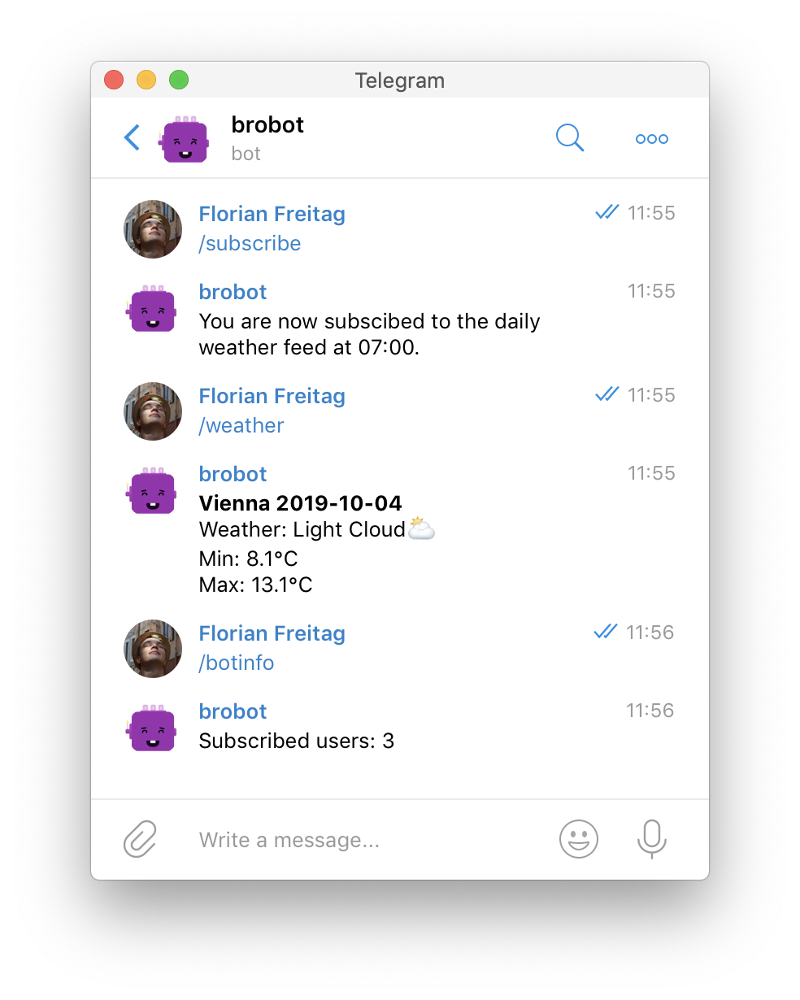

# Brobot
My personal telegram bot



## Run the bot
```bash
go build
TELEGRAM_TOKEN=XXXX ./brobot
```
Replace the XXXX with your telegram token

## Run the bot with docker
```bash
docker build -t brobot-template .
docker run -e TELEGRAM_TOKEN=XXXX --rm --name brobot-container brobot-template
```
Replace the XXXX with your telegram token

Note: Those commands will run the bot in a docker container, however all state
will be lost, when you shut down the container. To prevent this you can use:
```bash
docker volume create brobot-volume
docker build -t brobot-template .
docker run --env TELEGRAM_TOKEN=XXXX \
      --mount type=volume,source=brobot-volume,target=/app/data \
      --name brobot-container brobot-template \
```

## Deploy the bot
Look into `deploy.md` to see how I deploy the bot.


