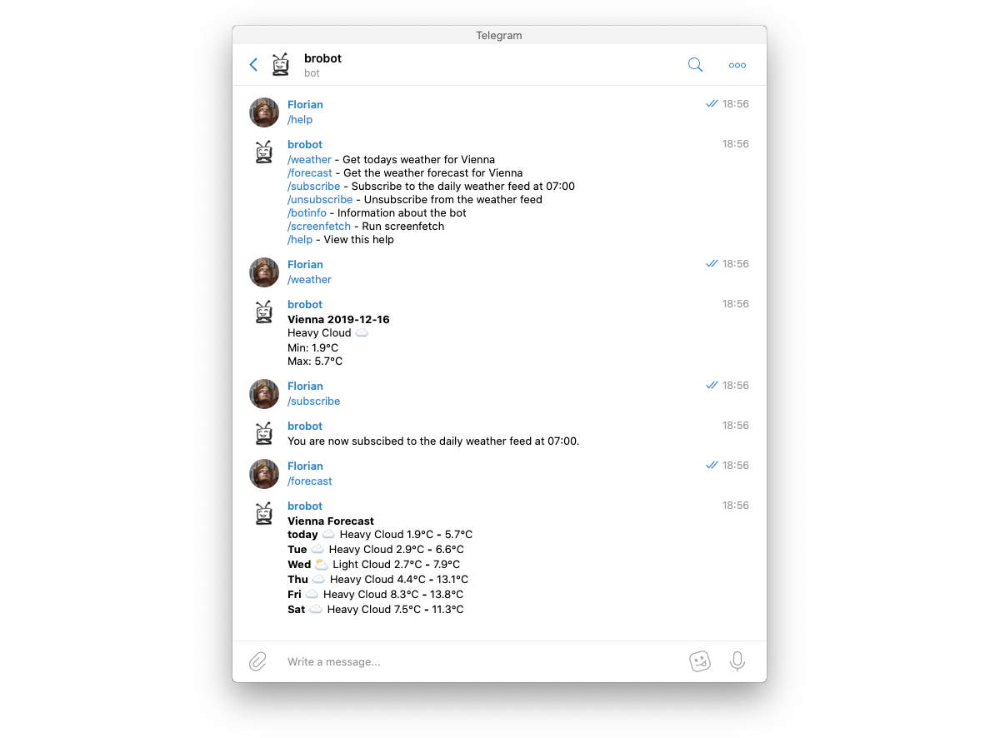

# Brobot
My personal telegram bot



## Setup 
Create a file `telegramtoken.txt` and put your [telegram Token](https://core.telegram.org/bots#3-how-do-i-create-a-bot) in it.

## Run the bot
```bash
go build
./brobot
```

## Deploy the bot
I deploy the bot on a Raspberry Pi 1 B+ I had laying around. At the moment the bot is just a simple systemd service. In
the future I might convert it to a docker container, but at the moment it isn't really necessary.

Also, I am really sorry but all commands in here are for Unix systems. If you run Windows you might be able to run the
commands via WSL.

### Setup the pi
This only has to be done once.
```bash
scp brobot.service pi@192.168.8.164:/home/pi/brobot.service
ssh pi@192.168.8.164 /bin/bash << EOF
sudo mv /home/pi/brobot.service /etc/systemd/system/brobot.service
sudo apt install screenfetch
mkdir /home/pi/brobot
EOF
```

### Upload a new version
This must be done every time you run a new version

You need to install sshpass on your system to run the deployment script.
```bash
bash pi-deploy.sh
```

### Uninstall the bot
In case you want to get rid of the bot, run:
```
ssh pi@192.168.8.164 /bin/bash << EOF
sudo systemctl stop brobot
sudo rm /etc/systemd/system/brobot.service
rm -r /home/pi/brobot
EOF
```
